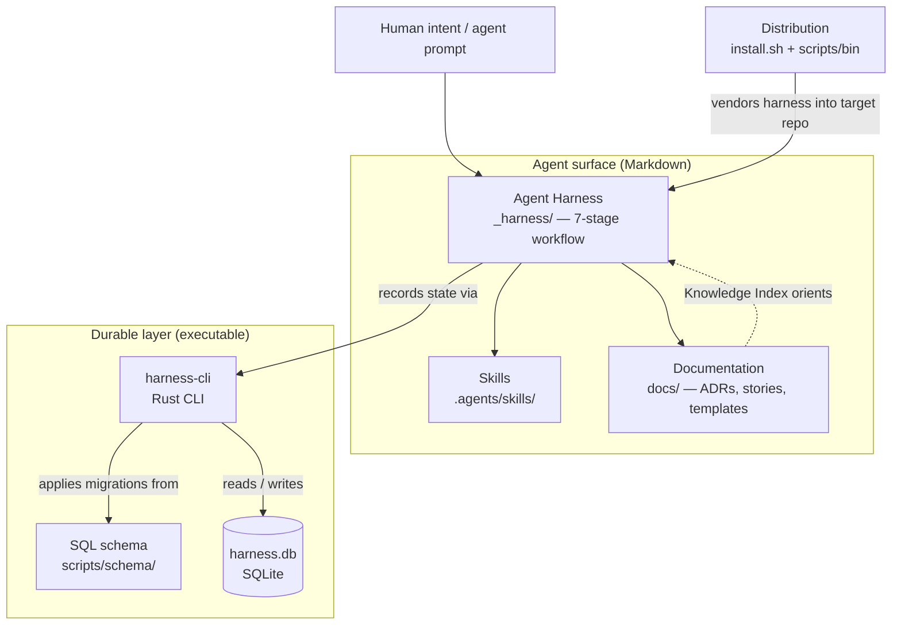

# repo-harness DeepWiki

> Auto-generated wiki derived from the repository tree. Every claim links back to
> real source. Code wins on conflict.

## Overview

`repo-harness` turns any software repository into an **agent-ready workspace**.
It is a repository-level operating harness for coding agents (Claude Code,
Codex, Cursor, …): it gives them the project context they need _before_ they
change code — where to start, what the product contract says, how risky the work
is, what proof is required, and which decisions to inherit. Policy lives in
Markdown; the operational records agents produce (intakes, stories, decisions,
backlog, traces) are stored in a local SQLite database driven by a small Rust
CLI.

The app is what users touch. The harness is what agents touch.

## Architecture



## Tech stack

- **Rust** (2021 edition, Cargo workspace) — the `harness-cli` crate.
- **clap** — command-line parsing; **thiserror** — typed errors;
  **rusqlite** (bundled SQLite) — durable storage.
- **SQLite** — the durable layer (`harness.db`), defined by SQL migrations.
- **Markdown** — all policy, workflow, decisions, stories, and these wiki pages.
- **Prettier** — Markdown formatting (`.prettierrc`, `.prettierignore`).
- **Bash** — install scripts (`install.sh`, `install-harness-cli.sh`).

## Getting started

Detected commands (from [`Cargo.toml`](../../Cargo.toml) and the environment
blueprint):

```bash
# Build the CLI
cargo build --release

# Run the test suite
cargo test --release

# Lint
cargo clippy --all-targets
prettier --check .

# Use the prebuilt CLI in an installed repo
scripts/bin/harness-cli init          # create harness.db
scripts/bin/harness-cli query matrix  # show story proof status
```

See [Distribution](./distribution.md) for installing the harness into another
repo.

## Pages

| Page                                     | Purpose                                                                       |
| ---------------------------------------- | ----------------------------------------------------------------------------- |
| [harness-cli](./harness-cli.md)          | The Rust CLI crate — clean-architecture layers, commands, and services.       |
| [Data model](./data-model.md)            | The SQLite durable layer: tables, migrations, and how records relate.         |
| [Agent Harness](./agent-harness.md)      | The `_harness/` execution framework: the 7-stage workflow and skill registry. |
| [Documentation](./documentation.md)      | The human-facing `docs/` reference: ADRs, stories, templates, glossary.       |
| [Skills](./skills.md)                    | Agent-invocable generators under `.agents/skills/` (deepwiki, knowledge).     |
| [Distribution](./distribution.md)        | Install scripts and the `scripts/` directory that vendor the harness.         |

## Repository map

| Path                                        | Description                                                            |
| ------------------------------------------- | ---------------------------------------------------------------------- |
| [`crates/`](../../crates)                   | Rust workspace; contains the `harness-cli` crate (the durable layer).  |
| [`scripts/`](../../scripts)                 | Prebuilt CLI binary, SQL schema migrations, and automation docs.       |
| [`_harness/`](../../_harness)               | Agent execution framework: workflow, standards, CLI reference, skills. |
| [`docs/`](../../docs)                       | Human reference docs: architecture, decisions, stories, templates.     |
| [`.agents/`](../../.agents)                 | Agent-invocable skills (deepwiki, knowledge-index).                    |
| [`guides/`](../../guides)                   | Long-form guides on the harness process and design.                    |
| [`install.sh`](../../install.sh)            | Vendors the harness (docs, `_harness`, scripts) into a target repo.    |
| [`AGENTS.md`](../../AGENTS.md)              | Agent entrypoint; points at `_harness/00-AGENTS.md`.                   |
| [`Cargo.toml`](../../Cargo.toml)            | Workspace manifest.                                                    |
