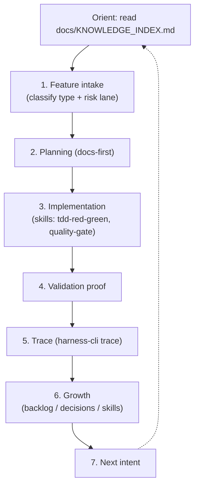

# Agent Harness

## Summary

The `_harness/` directory is the **execution framework agents read** before
doing work. It is written in an imperative voice (primarily Vietnamese) and
defines a gated 7-stage workflow, architecture/quality standards, the exact CLI
syntax for the durable layer, and an on-demand skill registry. Agents enter here
via [`AGENTS.md`](../../AGENTS.md); humans use the deeper reference under
[`docs/`](./documentation.md).

## Key files

- [`_harness/00-AGENTS.md`](../../_harness/00-AGENTS.md) — entrypoint &
  philosophy: the source-of-truth hierarchy, durable-layer rule, and the
  mandatory "Execution Tracker" output format.
- [`_harness/01-WORKFLOW.md`](../../_harness/01-WORKFLOW.md) — the 7-stage work
  loop and per-lane token budgets (Tiny / Normal / High-risk).
- [`_harness/02-STANDARDS.md`](../../_harness/02-STANDARDS.md) — architecture &
  coding standards (parse-first, dependency rule).
- [`_harness/03-CLI_REFERENCE.md`](../../_harness/03-CLI_REFERENCE.md) —
  canonical `harness-cli` command/flag reference.
- [`_harness/04-SKILLS.md`](../../_harness/04-SKILLS.md) — the skill contract
  and trigger → skill-file registry.
- [`_harness/skills/`](../../_harness/skills) — the harness skill procedures
  (`tdd-red-green`, `quality-gate-review`, `generate-knowledge-index`, plus
  `_TEMPLATE.md`).

## Internals

The workflow is a closed loop from intent to the next intent, classifying risk
and emitting a Product Delta and/or a Harness Delta:

Risk classification drives a **lane** (Tiny / Normal / High-risk) via hard gates
(auth, data migration, audit/security, external providers, weakened validation)
and a count of risk flags; the lane sets the context-token budget and how much
proof is required.

## Public interface

What the rest of the system relies on from this component:

- **Entry contract:** every agent starts at `AGENTS.md` →
  `_harness/00-AGENTS.md` → `_harness/01-WORKFLOW.md`.
- **Source-of-truth hierarchy:** user spec → `docs/product/*` → `docs/stories/*`
  → `harness-cli query matrix` → `docs/decisions/*`. On conflict, the hierarchy
  wins over the Knowledge Index (which is only an orientation router).
- **Skill registry:** the table in [`04-SKILLS.md`](../../_harness/04-SKILLS.md)
  maps a trigger/phase to exactly one skill file to load on demand (no
  preloading).
- **Durable-layer mandate:** all operational state must be written through
  `harness-cli`, never hand-edited.

## Dependencies

- **In:** [Documentation](./documentation.md) (the deep reference it points to),
  [harness-cli](./harness-cli.md) (the CLI it mandates), and the
  [Data model](./data-model.md) (where state lands).
- **Out:** the [Skills](./skills.md) surface mirrors `_harness/skills/` for
  agent "/skills" entrypoints.

[← Home](./README.md)
