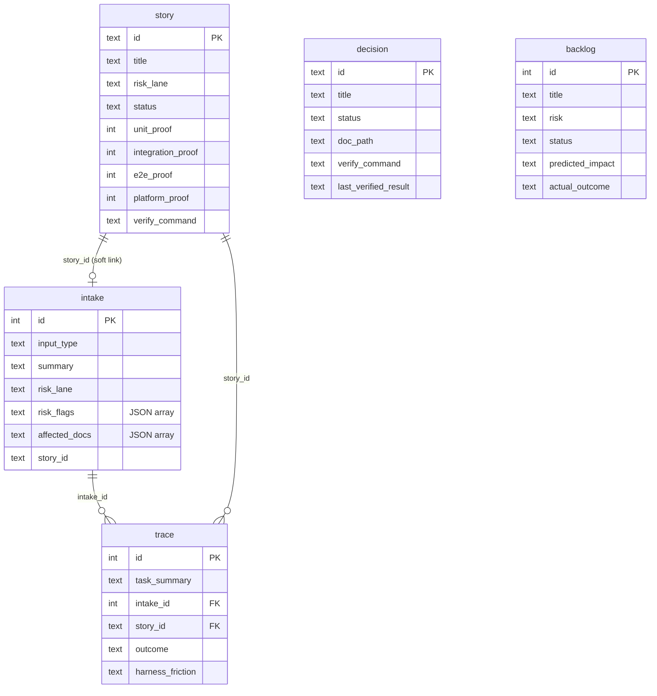

# Data model

## Summary

The harness keeps **policy in Markdown but operational data in SQLite**. The
durable layer is a local `harness.db` file whose shape is defined entirely by
ordered SQL migrations under [`scripts/schema/`](../../scripts/schema). The
[`harness-cli`](./harness-cli.md) crate creates the database, applies
migrations, and reads/writes these tables. There are no ORMs or hand-edited
database files — the schema is the source of truth.

## Key files

- [`scripts/schema/001-init.sql`](../../scripts/schema/001-init.sql) — base
  schema: `schema_version`, `intake`, `story`, `decision`, `backlog`, `trace`.
- [`scripts/schema/002-story-verify.sql`](../../scripts/schema/002-story-verify.sql)
  — adds `verify_command`, `last_verified_at`, `last_verified_result` to
  `story`.
- [`crates/harness-cli/src/domain.rs`](../../crates/harness-cli/src/domain.rs) —
  the record structs and enums (`InputType`, `RiskLane`) mirroring these tables.

## Internals

`trace.intake_id` references `intake(id)` and `trace.story_id` references
`story(id)`; `intake.story_id` is a soft link to a story created from that
intake. `schema_version` records which migrations have been applied — the CLI
reads `MAX(version)` to decide what to migrate.

## Public interface

These tables are reached only through the [`harness-cli`](./harness-cli.md)
commands, not edited directly:

| Table      | Written by            | Read by (query view)        |
| ---------- | --------------------- | --------------------------- |
| `intake`   | `intake`              | `query intakes`             |
| `story`    | `story add/update`    | `query matrix`              |
| `decision` | `decision add/verify` | `query decisions`           |
| `backlog`  | `backlog add/close`   | `query backlog`             |
| `trace`    | `trace`               | `query traces` / `friction` |

CHECK constraints encode the domain vocabulary — e.g. `risk_lane` ∈
`{tiny, normal, high_risk}`, story `status` ∈
`{planned, in_progress, implemented, changed, retired}`, trace `outcome` ∈
`{completed, blocked, partial, failed}`. List-valued columns store JSON arrays,
produced from CSV input by `CsvList` in
[`domain.rs`](../../crates/harness-cli/src/domain.rs#L156-L185).

## Dependencies

- **In:** none — this is the innermost data definition.
- **Out:** consumed by [harness-cli](./harness-cli.md), which applies these
  migrations and surfaces the [Agent Harness](./agent-harness.md) `query` views.

[← Home](./README.md)
