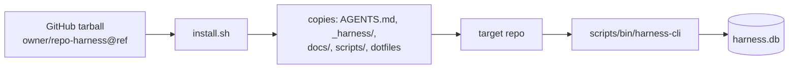

# Distribution

## Summary

This component is how the harness gets **into another repository**. Two Bash
installers fetch the harness from GitHub and copy it into a target project, and
the [`scripts/`](../../scripts) directory ships the prebuilt CLI binary, the SQL
schema, and operator docs. An installed project uses the vendored harness and
the prebuilt `harness-cli` without needing a Rust toolchain.

## Key files

- [`install.sh`](../../install.sh) — vendors the full harness (`.editorconfig`,
  `.prettierrc/.prettierignore`, `AGENTS.md`, `_harness/`, `docs/`, `scripts/`)
  into a target directory from a release tarball.
- [`install-harness-cli.sh`](../../install-harness-cli.sh) — installs just the
  CLI binary.
- [`scripts/bin/harness-cli`](../../scripts/bin/harness-cli) — the prebuilt CLI
  used by installed repos (Windows: `harness-cli.exe`).
- [`scripts/schema/`](../../scripts/schema) — SQL migrations applied by the CLI
  (see [Data model](./data-model.md)).
- [`scripts/README.md`](../../scripts/README.md) — CLI usage cheatsheet.

## Internals

`install.sh` resolves owner/repo/ref from `HARNESS_LITE_*` environment
variables, downloads a codeload tarball into a temp dir, and copies a fixed
`INSTALL_ITEMS` list into `TARGET_DIR` (default: the current directory). It
fails fast if `curl` or `tar` is missing.

## Public interface

- **Install everything:** run [`install.sh`](../../install.sh) from the target
  repo root (override `HARNESS_LITE_OWNER` / `HARNESS_LITE_REPO` /
  `HARNESS_LITE_REF` / `HARNESS_LITE_TARGET_DIR` as needed).
- **Install just the CLI:** run
  [`install-harness-cli.sh`](../../install-harness-cli.sh).
- **Run the durable layer:** `scripts/bin/harness-cli <command>` — see
  [`scripts/README.md`](../../scripts/README.md) and
  [`_harness/03-CLI_REFERENCE.md`](../../_harness/03-CLI_REFERENCE.md).

## Dependencies

- **In:** packages the [Agent Harness](./agent-harness.md),
  [Documentation](./documentation.md), and the [harness-cli](./harness-cli.md)
  binary + [Data model](./data-model.md) schema.
- **Out:** requires only `curl`, `tar`, and a POSIX shell on the target host.

[← Home](./README.md)
