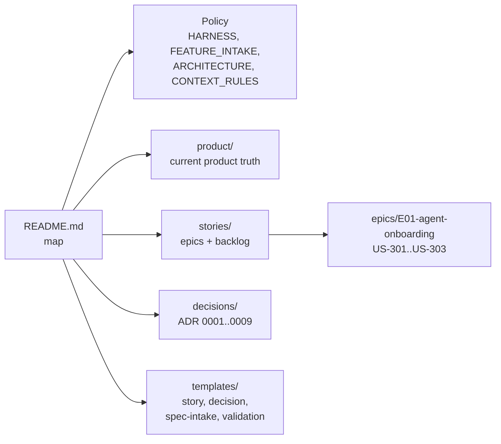

# Documentation

## Summary

The [`docs/`](../../docs) tree is the **human-facing reference layer** —
policies, rationale, taxonomy, glossary, decisions, stories, and templates. It
is the deep counterpart to the agent-facing [Agent Harness](./agent-harness.md):
where `_harness/` tells an agent _what to do_, `docs/` explains _why_ and stores
the durable narrative artifacts. It begins at
[`docs/README.md`](../../docs/README.md).

> Note: `docs/wiki/` (this DeepWiki) is generated and lives alongside the
> reference docs but is not part of the harness contract.

## Key files

- [`docs/HARNESS.md`](../../docs/HARNESS.md) — how humans and agents
  collaborate.
- [`docs/FEATURE_INTAKE.md`](../../docs/FEATURE_INTAKE.md) — how prompts become
  tiny / normal / high-risk work.
- [`docs/ARCHITECTURE.md`](../../docs/ARCHITECTURE.md) — architecture discovery
  and boundary rules.
- [`docs/GLOSSARY.md`](../../docs/GLOSSARY.md) — shared vocabulary.
- [`docs/CONTEXT_RULES.md`](../../docs/CONTEXT_RULES.md) — what to read, when,
  and when to stop.
- [`docs/KNOWLEDGE_INDEX.md`](../../docs/KNOWLEDGE_INDEX.md) — the onboarding
  router (generated/maintained by the knowledge skill).
- [`docs/HARNESS_COMPONENTS.md`](../../docs/HARNESS_COMPONENTS.md) /
  [`HARNESS_MATURITY.md`](../../docs/HARNESS_MATURITY.md) — responsibility
  taxonomy and maturity tracking.

## Internals

The subtree splits into **policy** (the reference essays), **durable narrative**
(`product/`, `stories/`, `decisions/`), and **templates** that seed new
artifacts. Decisions are numbered ADRs (`0001`…`0009`); stories are organized
under epics (e.g. `E01-agent-onboarding`).

## Public interface

- The [Agent Harness](./agent-harness.md) hierarchy points here:
  `docs/product/*` and `docs/stories/*` are authoritative product truth,
  `docs/decisions/*` are inherited tradeoffs.
- [`docs/templates/`](../../docs/templates) provides the canonical shapes for
  stories, decisions, spec intake, and validation reports — including the
  `high-risk-story/` packet (overview, execplan, design, validation).
- `docs/KNOWLEDGE_INDEX.md` is the read-first orientation map for every lane.

## Dependencies

- **In:** authored and updated by agents following the
  [Agent Harness](./agent-harness.md); the [Skills](./skills.md) generators
  write `docs/KNOWLEDGE_INDEX.md`.
- **Out:** referenced by `_harness/` as the deep-reference layer; legacy proof
  state (`TEST_MATRIX.md`, `HARNESS_BACKLOG.md`) is superseded by the
  [Data model](./data-model.md).

[← Home](./README.md)
