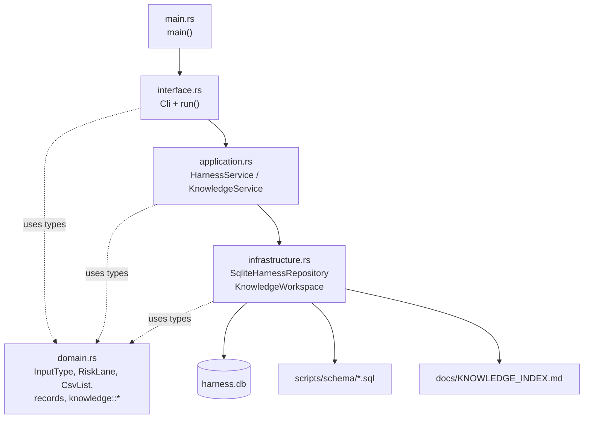

# harness-cli

## Summary

`harness-cli` is the only executable component in the repository — a single Rust
binary that owns the **durable layer**. Policy stays in Markdown; this CLI
records and queries the operational data agents produce while working (intakes,
stories, decisions, backlog items, registered tools, interventions, traces) in a
local SQLite database (`harness.db`). It also scores traces and context reads,
runs the drift audit, generates improvement proposals, and scaffolds/checks the
repository Knowledge Index.

The crate follows a **clean / hexagonal architecture**: dependencies point
inward toward `domain`, and each layer lives in its own module.

## Key files

- [`crates/harness-cli/src/main.rs`](../../crates/harness-cli/src/main.rs) —
  entrypoint; parses `Cli` and dispatches to `interface::run`.
- [`crates/harness-cli/src/interface.rs`](../../crates/harness-cli/src/interface.rs)
  — clap command tree, argument structs, and table rendering (the outer
  adapter).
- [`crates/harness-cli/src/application.rs`](../../crates/harness-cli/src/application.rs)
  — `HarnessService` and `KnowledgeService`; input DTOs and result types.
- [`crates/harness-cli/src/domain.rs`](../../crates/harness-cli/src/domain.rs) —
  pure types (`InputType`, `RiskLane`, `CsvList`, record structs) and the
  `knowledge` submodule (deterministic index rendering).
- [`crates/harness-cli/src/infrastructure.rs`](../../crates/harness-cli/src/infrastructure.rs)
  — `SqliteHarnessRepository`, migrations, and `KnowledgeWorkspace`
  (filesystem).
- [`crates/harness-cli/Cargo.toml`](../../crates/harness-cli/Cargo.toml) — crate
  dependencies (`clap`, `rusqlite`, `thiserror`).

## Internals

The dependency rule is enforced by module boundaries: `domain` imports nothing
from the other layers; `infrastructure` and `interface` depend on `domain`;
`application` orchestrates between them. The `knowledge` command path is special
— it constructs its own filesystem-only `KnowledgeService` from the repo root
and never touches SQLite (see
[`interface.rs` `run`](../../crates/harness-cli/src/interface.rs#L619-L640)).

## Public interface

Top-level subcommands (the `Command` enum in
[`interface.rs`](../../crates/harness-cli/src/interface.rs#L33-L66)):

| Command                         | Purpose                                                                                                                  |
| ------------------------------- | ------------------------------------------------------------------------------------------------------------------------ |
| `init`                          | Create `harness.db` if missing; apply schema version 1.                                                                  |
| `migrate`                       | Apply pending schema migrations from `scripts/schema/`.                                                                  |
| `import brownfield`             | Seed the DB from existing `TEST_MATRIX`, decisions, and backlog Markdown.                                                |
| `intake`                        | Record a feature-intake classification (`--type`, `--summary`, `--lane`).                                                |
| `story add/update/verify(-all)` | Add a story, update its status and proof flags (unit/integration/e2e/platform), or run its configured verify command.    |
| `decision add/verify`           | Record an ADR or run its configured verify command.                                                                      |
| `backlog add/close`             | Track harness-improvement proposals through an evidence loop.                                                            |
| `tool register/remove`          | Maintain the machine-readable registry of user-provided project tools.                                                   |
| `intervention add`              | Record a human / reviewer / CI / agent intervention (correction, override, escalation, approval).                        |
| `trace`                         | Record an agent execution trace (actions, files, outcome, friction).                                                     |
| `score-trace` / `score-context` | Score a trace against the quality tiers, or its context reads against `CONTEXT_RULES.md`.                                |
| `audit`                         | Run the drift audit and entropy score.                                                                                   |
| `propose`                       | Generate improvement proposals from observed patterns.                                                                   |
| `query <view>`                  | Read views: `matrix`, `backlog`, `decisions`, `intakes`, `traces`, `friction`, `tools`, `interventions`, `stats`, `sql`. |
| `knowledge scaffold/check`      | Generate or verify `docs/KNOWLEDGE_INDEX.md`.                                                                            |

Resolution of paths is environment-driven:
[`resolve_context`](../../crates/harness-cli/src/interface.rs#L957-L970) honors
`HARNESS_REPO_ROOT` and `HARNESS_DB`, defaulting the database to
`<repo_root>/harness.db` and schema to `<repo_root>/scripts/schema`.

The persistence contract is the
[`HarnessRepository` trait](../../crates/harness-cli/src/infrastructure.rs#L65-L97),
implemented by `SqliteHarnessRepository`.

## Dependencies

- **In:** [Data model](./data-model.md) — the SQL schema this crate applies and
  queries; the [Skills](./skills.md) and [Agent Harness](./agent-harness.md)
  surfaces invoke this CLI to read/write durable state.
- **Out:** external crates `clap`, `rusqlite` (bundled SQLite), `thiserror`.

[← Home](./README.md)
