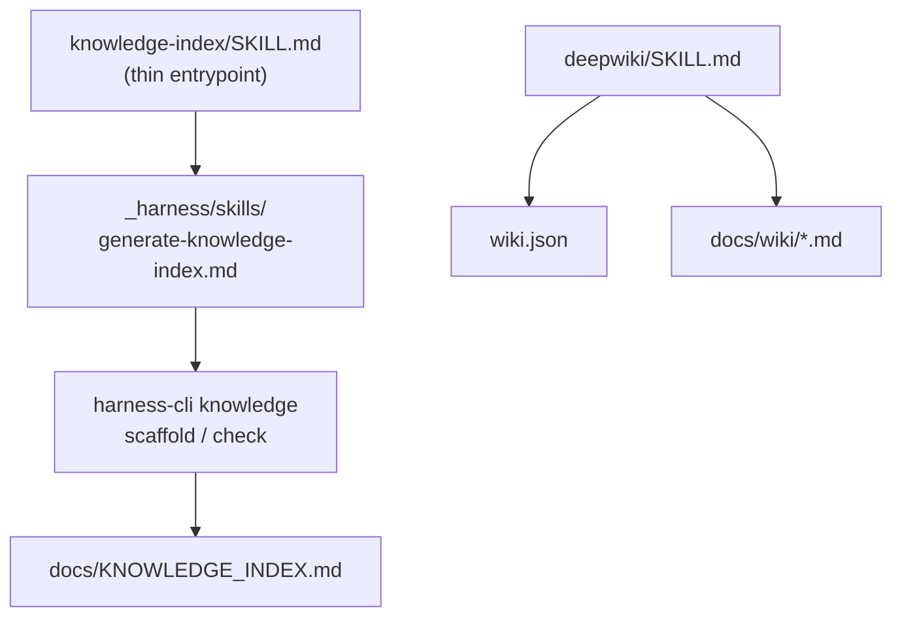

# Skills

## Summary

[`.agents/skills/`](../../.agents/skills) holds **agent-invocable skills** —
self-contained, trigger-based procedures an agent loads on demand (e.g. via a
Codex `/skills` surface). Each skill is a `SKILL.md` with YAML frontmatter
(`name`, `description`) plus, optionally, steering config. They are the outward
"skill" face of the procedures registered in the
[Agent Harness](./agent-harness.md).

## Key files

- [`.agents/skills/deepwiki/SKILL.md`](../../.agents/skills/deepwiki/SKILL.md) —
  the repo-agnostic DeepWiki generator that produces _this_ wiki under
  `docs/wiki/`.
- [`.agents/skills/deepwiki/wiki.json`](../../.agents/skills/deepwiki/wiki.json)
  — steering for the DeepWiki skill (`output_dir`, include/exclude globs,
  `repo_notes`, explicit `pages`).
- [`.agents/skills/knowledge-index/SKILL.md`](../../.agents/skills/knowledge-index/SKILL.md)
  — thin entrypoint that delegates to the canonical harness procedure.

## Internals

The `knowledge-index` skill is deliberately thin: the verifiable procedure lives
in
[`_harness/skills/generate-knowledge-index.md`](../../_harness/skills/generate-knowledge-index.md),
and the deterministic sections of the index are regenerated by
`harness-cli knowledge`. The `deepwiki` skill is standalone and depends only on
the repo's own source plus its `wiki.json`.

## Public interface

- **`deepwiki`** — generates a navigable Markdown wiki (home + one page per
  major component) under the configured `output_dir` (default `docs/wiki/`),
  with a mechanical verify gate (home exists, at least one mermaid diagram, no
  placeholders, no orphan pages, no broken intra-wiki links).
- **`knowledge-index`** — generates/refreshes `docs/KNOWLEDGE_INDEX.md`; the
  authored Purpose/Concepts blocks are preserved between HTML-comment markers
  while deterministic sections are regenerated.

## Dependencies

- **In:** [harness-cli](./harness-cli.md) (`knowledge` command), the
  [Agent Harness](./agent-harness.md) skill procedures under `_harness/skills/`.
- **Out:** writes into [Documentation](./documentation.md)
  (`docs/KNOWLEDGE_INDEX.md` and `docs/wiki/`).

[← Home](./README.md)
